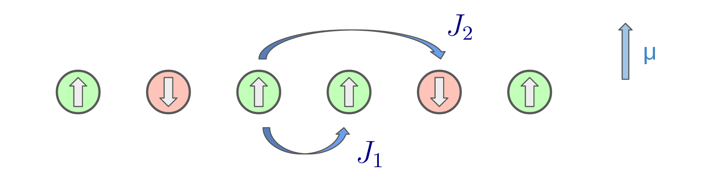

.. PhaseEstimationThroughQML documentation master file, created by
   sphinx-quickstart on Thu Jun 30 21:20:05 2022.
   You can adapt this file completely to your liking, but it should at least
   contain the root `toctree` directive.

Welcome to PhaseEstimationThroughQML's documentation!
=====================================================

.. image:: https://img.shields.io/badge/CERN-CERN%20openlab-blue
   :target: https://openlab.cern/

.. image:: https://zenodo.org/badge/DOI/10.5281/zenodo.7090343.svg
   :target: https://doi.org/10.5281/zenodo.7090343

.. toctree::
   :maxdepth: 2
   :caption: Contents:

   modules

Indices and tables
==================

* :ref:`genindex`
* :ref:`modindex`
* :ref:`search`
